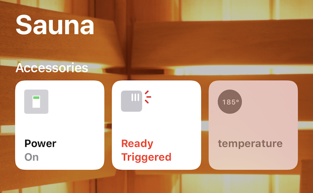
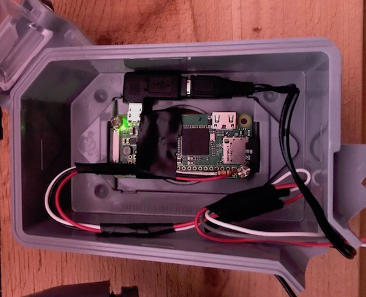
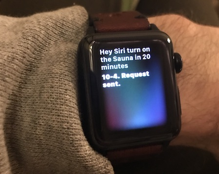

# SaunaKit
*This README and all other documentation and software in this repository are covered by the attached MIT license. Nothing in this repository should be construed as a recommendation or assertion that something is safe, legal or otherwise a good idea. Connecting a heater or any other electric device to a computer could do terrible things, like burn your house down. I’m not responsible for anything that happens if you choose to use this knowledge, so MAKE USE OF IT EXCLUSIVELY AT YOUR OWN RISK.*

## The Design

Traditional saunas take a while to heat up. Hence, being able to start heating your sauna automatically is a major convenience. Using SaunaKit, you could start it with Siri before you bike home from work and have it ready when you arrive. You could start it on a schedule so it is ready when you wake up in the morning, you could even wear a Galvanic Skin Response sensor and have it start your sauna when you get stressed out. Conceivably.

SaunaKit also lets you check the temperatue of the sauna, and sends you a push notification when the sauna has reached the target temperature.

I designed SaunaKit to be invisible when in use. The sauna can only be switched *on* programmatically, but once on it acts just like an analog system. After starting the sauna you won’t touch your phone again. The sauna temperature is controlled using the built in analog thermostat. The sauna can be turned *off* using the built in analog power switch.

Lastly, I had a few technical considerations in how I designed SaunaKit. First, not withstanding the above disclaimer, I tried to make it safer by using a system of independent components, each of which has a clear and simple purpose[1](#f1).

## Sauna Requirements
First, you need a traditional sauna room. If you are just getting started, [Cedar Brook Sauna](https://www.cedarbrooksauna.com) in Washington State has some great how-to guides for the DIY’er. You can also buy one of their precut or prefabricated kits.

Once you’ve got the sauna room built, you need to get an electric heater with *separate, timerless controls* (sometimes called ‘Club Controls’[2](#f2)), such as [this one](https://www.cedarbrooksauna.com/polar-hnvr-60sc-with-psc-external-controls.html). Most heaters have a built-in timer. You twist it to start the heater, and when it runs out the heater turns itself off. That won’t work if you want to start it remotely. What you need as a simple on/off switch you can leave in the On position and then control via a separate switch. You should hire a licensed electrician to wire your sauna and controls. When they are doing the work, have them install the Z-Wave switch as well (see below).

If you already own a heater with built in controls, you won't be able to operate it remotely without replacing it. You could still follow the relevant parts of this guide to set up temperature monitoring and push notifications.

## Basic System Components
SaunaKit consists of three principle components:

1. **The Temperature Sensor**, a [Raspberry Pi](https://www.raspberrypi.org). Get a Pi with WiFi unless you have an ethernet port near your sauna (wtf?). The sensor device itself is the DS18B20, which you can get in an easy-to-use [waterproof form factor from Sparkfun](https://www.sparkfun.com/products/11050).
2. **The Switch**, an [Aeotec Heavy Duty Z-Wave Switch](https://aeotec.com/outdoor-z-wave-switch). The switch can be remotely controlled using the Z-Wave protocol and is rated for 240v and up to 40 amps, which should be enough for most small sauna heaters. It also has built in power monitoring, which allows you to monitor energy usage and is useful for automation (see below).
3. **The Brain**, a second Raspberry Pi running [Home Assistant](https://www.home-assistant.io)[3](#f3). This will talk to both the temperature sensor and the switch. This Pi is ideally installed near your router, connected via ethernet. You’ll also need a Z-Wave USB adapter to talk to the switch. I recommend [Aeotec’s Z-Stick](https://aeotec.com/z-wave-usb-stick).

## Setting up the Temperature Sensor

### Hardware setup

First, you’ll need to solder the sensor to your Pi with an appropriate pull-up resistor inline. There’s a guide on how to do that [here](https://learn.adafruit.com/adafruits-raspberry-pi-lesson-11-ds18b20-temperature-sensing/hardware). Mount the Pi outside the sauna somewhere. I used a weatherproof electrical box on the outside wall. Drill a hole in the wall wherever you want the sensor to be located, and run it through. I have my sensor sticking out of the wall right inside the heater’s thermostat sensor cover, which makes it almost invisible.

### Software setup
*This section is probably a little hard to follow if you are new to Python or Raspberry Pi. If you’d like to improve the instructions or provide a more ready-to-go solution, pull requests are welcome! In the meantime, [this guide](https://www.raspberrypi-spy.co.uk/2017/07/create-a-basic-python-web-server-with-flask/) may be helpful in the basics of getting a Pi running Flask set up.*

Log on to your Pi and add the following to the end of the /boot/config.txt file, which tells the Pi where to look for the temperature sensor:

`dtoverlay=w1-gpio`

At this point your Pi is capable of reading the temperature in your sauna, but it needs a way to communicate that back to the second Pi running Home Assistant. The way we’ll do that is to run a really simple web server that just shows the basic temperature. The server is run using Flask, which you’ll need to install and configure to run when the Pi boots up (see above). 

The [Flask application itself](/Temperature\ Sensor/temperature.py) is extremely simple. It reads the temperature and makes it available as a json file in Fahrenheit and Celsius. 

## Setting up the Switch
Hire a licensed electrician to do this when they are wiring the heater and controls. The switch should control the entire 240v circuit the sauna is on and can be installed somewhere near your panel. Once you have set up Home Assistant, follow the switch’s printed instructions to get it paired with the Z-Stick, restart Home Assistant and then you should be good to go.

## Setting up the Brain
The simplest way to get Home Assistant up and running on a Raspberry Pi is to use [Hass.io](https://www.home-assistant.io/hassio/), which has full SD card images for every Raspberry Pi model. Follow the [installation instructions](https://www.home-assistant.io/hassio/installation/) and you should have what you need to set up SaunaKit.

Once you have successfully set up Home Assistant, we need to add the configuration files so we can set things up for SaunaKit. [SSH](https://www.home-assistant.io/addons/ssh/) onto your Home Assistant Pi, and then navigate to the `/config` directory. The contents of the following two files should be *appended* to the existing files in this directory of the same name.

* [configuration.yaml](/Home\ Assistant/config/configuration.yaml)
	- Configures Home Assistant to use the Z-Stick for Z-Wave communication
	- Creates a software temperature sensor using the web server we exposed from our temperature sensor. Note that you’ll need to change this to include the actual IP of your Pi.
	- Creates another ‘binary sensor’ using the temperature sensor web server. This one checks to see if the temperature is currently above the target temperature (160ºF)[4](#f4).
	- Creates a timer which will turn the sauna off. The actual behavior is defined in automations.yaml below.
* [automations.yaml](/Home\ Assistant/config/automations.yaml)
	- Starts the timer at one hour when the sauna power turns on.
	- Turns off the sauna when the timer elapses.
	- Cancels the timer when the sauna otherwise turns off.
	- Turns off the sauna when the detected power goes near 0, which lets you use the club control’s built-in power switch to turn the *Z-Wave switch* off [5](#f5). You can then flip the club control switch back on so it is primed for the next use.

Lastly, you should set up the Homekit component as described [here](https://www.home-assistant.io/components/homekit/). This will let you control the sauna not only from Home Assistant but from the Home app and using Siri.

--
<small>1. Rather than build a high-voltage switch using a solid state relay, I used an off-the-shelf switch designed for automation. I kept the switch completely separate from the system used to control it, as well as from the temperature sensor. I decided not to programmatically control the temperature and instead use the heater’s built in thermostat and controls.</small> [↩](#a1)

<small>2. Such controls are called ‘Club Controls’ because timerless controls are only intended for use in a club when attendant is on duty. Our system will have a software timer, but I have no idea if this is legal in your state or safe. See the disclaimer above again.</small> [↩](#a2)

<small>3. If you didn’t want to do any hacking, I suppose you could use a consumer home automation hub such as the [Wink Hub](https://www.wink.com/products/wink-hub/) to accomplish the basic remote start without the temperature sensor. </small> [↩](#a3)

<small>4. You’ll notice the device_class is set to ‘smoke’. This is one of my favorite hacks. For whatever Apple-type reason, the Home app only allows certain types of sensors to deliver a push notification using the built in Home app. Smoke alarms are one such sensor, so my solution was to emulate a smoke alarm. I never tire of getting a ‘Smoke detected in Sauna’ notification 😆.</small> [↩](#a4)

<small>5. This is my other favorite hack. When you turn it off, the power usage will go to nearly 0. This triggers the automation to turn the Z-Wave switch off. When the sauna is cycling on and off to maintain temperature, the heater still draws a small amount of power (~5W on my heater) so you don’t have to worry about it turning itself off when it shouldn’t.  </small> [↩](#a5)

